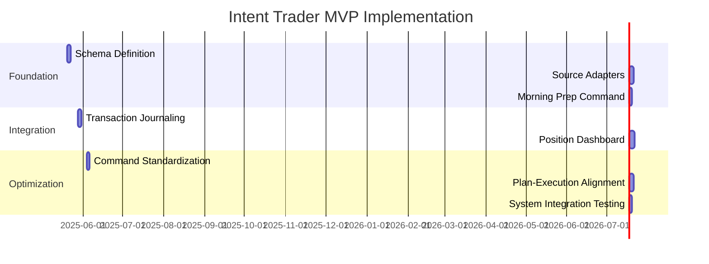
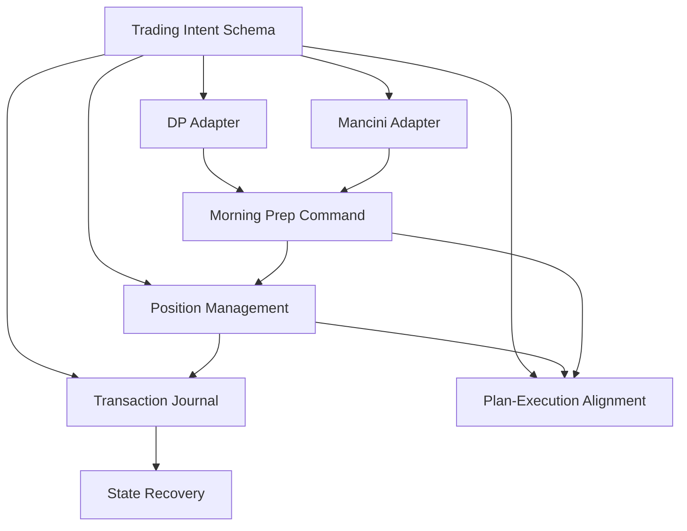

# Intent Trader System Overhaul Plan
**Document Version:** 1.0  
**Last Updated:** May 19, 2025  
**Project Owner:** [Your Name]  
**Status:** Draft  

## Executive Summary

This plan outlines a comprehensive overhaul of the Intent Trader system to address critical architectural issues while maintaining focus on the highest-ROI improvements for a solo trader. The plan prioritizes workflow streamlining, data schema standardization, and system reliability to maximize trading effectiveness with minimal development effort.

The overhaul will be implemented in three phases over 3-4 weeks:
1. **Foundation Phase** - Implement unified data schema and core commands
2. **Integration Phase** - Enhance position management and state integrity
3. **Optimization Phase** - Refine and optimize for daily trading efficiency

This document serves as the authoritative guide for the Intent Trader MVP development effort.

## Current System Analysis

### Key Issues Identified

1. **Workflow Inefficiency**
   - Multi-step morning preparation requires 15-20 minutes of manual work
   - Multiple failure points in critical workflow chains
   - Information loss between transformation steps

2. **Schema Inconsistency**
   - Four different incompatible data schemas (`analyze-dp`, `analyze-mancini`, `create-plan`, `position-tracking`)
   - Manual reconciliation required between components
   - No clear source attribution or data lineage

3. **System Fragility**
   - State corruption risks during rapid updates
   - No transaction logging or error recovery mechanisms
   - Plan-execution disconnect limits trading discipline

4. **Cognitive Overhead**
   - ~14 different commands with inconsistent parameter syntax
   - High mental load during critical trading periods
   - Excessive manual intervention required during volatility

## Vision for Overhauled System

### Core Principles

1. **Workflow Consolidation** - Single unified commands for complete workflows
2. **Data Standardization** - Consistent schema across all components
3. **State Integrity** - Bulletproof position tracking with recovery mechanisms
4. **Cognitive Efficiency** - Minimal command set with consistent structure
5. **Trading Discipline** - Clear alignment between plan and execution

### Target Architecture

```
┌────────────────────────────────────────────────────────────────┐
│                    Unified Command Interface                    │
├────────────────────────────────────────────────────────────┬───┤
│                                                            │   │
│  ┌──────────────┐   ┌───────────────┐   ┌───────────────┐  │ C │
│  │ Morning Prep │   │ Position Mgmt │   │ Session Review│  │ M │
│  │   Engine     │   │   Dashboard   │   │     Tools     │  │ D │
│  └──────────────┘   └───────────────┘   └───────────────┘  │   │
│           │                 │                   │          │ L │
│           ▼                 ▼                   ▼          │ O │
│  ┌──────────────────────────────────────────────────────┐  │ G │
│  │               Unified Trading Intent Schema           │  │   │
│  └──────────────────────────────────────────────────────┘  │   │
│           │                 │                   │          │   │
│           ▼                 ▼                   ▼          │   │
│  ┌──────────────┐   ┌───────────────┐   ┌───────────────┐  │   │
│  │  DP Adapter  │   │ Position State│   │ Journal State │  │   │
│  │ Mancini Adpt │   │   Manager     │   │    Manager    │  │   │
│  └──────────────┘   └───────────────┘   └───────────────┘  │   │
│                                                            │   │
└────────────────────────────────────────────────────────────┴───┘
```

## Overhaul Implementation Plan

### Phase 1: Foundation (1.5 weeks)

#### 1.1 Unified Trading Intent Schema (3 days)

**Objective:** Create a standardized data schema that all system components will use

**Tasks:**
- [ ] Define comprehensive Trading Intent Schema specification
- [ ] Create schema validation logic and helper functions
- [ ] Implement normalization utilities for conviction, levels, etc.
- [ ] Develop unit test suite for schema validation

**Deliverables:**
- Trading Intent Schema JSON specification
- Schema validation library
- Normalization utilities
- Test suite for schema integrity

**Success Criteria:**
- Schema successfully validates all test cases
- Schema accommodates both DP and Mancini data structures
- Normalization functions handle all edge cases

#### 1.2 Source Adapters Implementation (3 days)

**Objective:** Enable DP and Mancini analysis to work with the unified schema

**Tasks:**
- [ ] Update `analyze-dp` to output standardized schema
- [ ] Update `analyze-mancini` to output standardized schema
- [ ] Create helper functions for source-specific data extraction
- [ ] Implement source-to-schema transformation logic

**Deliverables:**
- Updated `analyze-dp` module
- Updated `analyze-mancini` module
- Source-specific extraction utilities
- Full end-to-end tests for both sources

**Success Criteria:**
- Both sources output 100% schema-compliant data
- No information loss during transformation
- Source attribution maintained throughout

#### 1.3 Unified Morning Preparation Command (2 days)

**Objective:** Create single command for complete morning workflow

**Tasks:**
- [ ] Implement `/morning-prep` command with source auto-detection
- [ ] Create merger logic for DP and Mancini data
- [ ] Build unified plan generation from combined sources
- [ ] Design simple plan visualization output

**Deliverables:**
- `/morning-prep` command implementation
- Source merging logic
- Unified plan generator
- Plan visualization formatter

**Success Criteria:**
- Complete morning preparation in <10 minutes
- Handles both DP and Mancini inputs
- Generates comprehensive trading plan
- No manual intervention required

### Phase 2: Integration (1 week)

#### 2.1 Transaction Journaling System (3 days)

**Objective:** Implement bulletproof state management with recovery capabilities

**Tasks:**
- [ ] Design event-sourced state management architecture
- [ ] Implement command journaling for all state mutations
- [ ] Create state reconstruction from event log
- [ ] Build recovery mechanisms for system failures

**Deliverables:**
- Transaction journal specification
- Journal storage implementation
- State reconstruction utilities
- Recovery command interface

**Success Criteria:**
- All state changes captured in journal
- System can recover from any failure point
- No data loss during rapid updates
- Full audit trail of all commands

#### 2.2 Position Management Dashboard (4 days)

**Objective:** Create unified interface for position tracking and management

**Tasks:**
- [ ] Implement `/positions` dashboard command
- [ ] Create position subcommands (add, update, close)
- [ ] Build position visualization with status indicators
- [ ] Implement batch operations for multiple positions

**Deliverables:**
- `/positions` command implementation
- Position CRUD subcommands
- Position dashboard visualization
- Batch operation handlers

**Success Criteria:**
- All position operations available through dashboard
- Position actions take <5 seconds to execute
- Supports batch operations during volatility
- Real-time position status updates

### Phase 3: Optimization (1 week)

#### 3.1 Command Structure Standardization (2 days)

**Objective:** Implement consistent command structure to reduce cognitive load

**Tasks:**
- [ ] Design unified command pattern syntax
- [ ] Implement command router with standardized parameter handling
- [ ] Create backwards compatibility layer for existing scripts
- [ ] Build command help system with examples

**Deliverables:**
- Command pattern specification
- Command router implementation
- Backward compatibility layer
- Command help documentation

**Success Criteria:**
- All commands follow consistent pattern
- Parameter syntax standardized across system
- Existing scripts continue to function
- Help system provides clear examples

#### 3.2 Plan-Execution Alignment (3 days)

**Objective:** Create mechanisms to enforce trading discipline

**Tasks:**
- [ ] Implement plan-position validation logic
- [ ] Create trade compliance checking
- [ ] Build plan adherence metrics
- [ ] Develop plan adjustment mechanisms

**Deliverables:**
- Plan validation system
- Trade compliance checker
- Plan adherence reporting
- Plan adjustment utilities

**Success Criteria:**
- All trades validated against plan
- Deviations flagged with justification required
- Plan adherence tracked over time
- Easy plan adjustments during market hours

#### 3.3 System Integration Testing (2 days)

**Objective:** Ensure complete system reliability under realistic conditions

**Tasks:**
- [ ] Create end-to-end test scenarios
- [ ] Implement stress testing under load
- [ ] Test recovery from failure scenarios
- [ ] Validate performance metrics

**Deliverables:**
- Test scenario specifications
- Stress test suite
- Recovery test cases
- Performance benchmark results

**Success Criteria:**
- System handles full day trading simulation
- Recovers from all failure scenarios
- Meets performance targets
- Zero state corruption incidents

## Technical Specifications

### 1. Trading Intent Schema

```json
{
  "$schema": "https://intent-trader.mvp/schemas/v1/trading-intent.json",
  "version": "1.0",
  "meta": {
    "source": "dp|mancini|user|system|combined",
    "timestamp": "2025-05-19T12:30:45Z",
    "confidence": 0.95
  },
  "market": {
    "session": "pre|regular|post",
    "sentiment": "bullish|bearish|neutral|mixed",
    "volatility": "low|normal|high|extreme",
    "key_levels": [
      {
        "index": "SPX|NDX|RTY",
        "level": 4500,
        "type": "support|resistance|pivot|vwap",
        "strength": 0.8
      }
    ]
  },
  "opportunities": [
    {
      "id": "opportunity-20250519-aapl-long-01",
      "symbol": "AAPL",
      "direction": "long|short",
      "conviction": 0.8,
      "timeframe": "day|swing|position",
      "thesis": "Brief thesis rationale",
      "levels": {
        "entry": {
          "price": 150.50,
          "type": "limit|market|stop",
          "condition": "Optional condition"
        },
        "stop": {
          "price": 145.00,
          "type": "fixed|trailing|volatility",
          "risk_pct": 3.65
        },
        "targets": [
          {
            "price": 155.00,
            "type": "profit|scale",
            "size_pct": 50
          }
        ]
      },
      "tags": ["momentum", "earnings", "technical"],
      "status": "planned|active|completed|abandoned"
    }
  ],
  "risk": {
    "max_positions": 5,
    "max_correlated_positions": 3,
    "account_risk_per_trade_pct": 1.0,
    "total_account_risk_pct": 5.0
  }
}
```

### 2. Command Interface Specification

#### 2.1 Unified Command Pattern

```
/[workflow]-[action] [target] with [parameters]
```

**Examples:**
```
/morning-prep source=dp,mancini "transcript text"
/positions list with status=active
/positions update AAPL with stop=147.50
/journal replay 2025-05-19 with time=14:30:00
```

#### 2.2 Core Command Set

| Command | Subcommands | Parameters | Description |
|---------|-------------|------------|-------------|
| `/morning-prep` | N/A | `source`, `text` | Process morning analysis and create plan |
| `/positions` | `list`, `add`, `update`, `close` | Varies by subcommand | Manage trading positions |
| `/plan` | `show`, `update`, `filter` | Varies by subcommand | View and modify trading plan |
| `/journal` | `show`, `replay` | `date`, `time` | Manage transaction journal |

### 3. Transaction Journal Format

```json
{
  "timestamp": "2025-05-19T14:30:00Z",
  "command": "positions-update",
  "parameters": {"symbol": "AAPL", "action": "move-stop", "value": 147.50},
  "previousState": {"stop": 145.00},
  "newState": {"stop": 147.50},
  "user": "system",
  "status": "success",
  "id": "txn-20250519-1430-001"
}
```

## Development Environment

### Tooling

- **Version Control:** Git with GitHub
- **Project Management:** Linear/Asana board with task tracking
- **Testing:** Jest for unit testing, custom framework for integration tests
- **Documentation:** Markdown in repository with auto-generated API docs

### Development Practices

1. **Test-Driven Development**
   - Write tests before implementation
   - Maintain >80% test coverage
   - Include integration tests for critical workflows

2. **State Management**
   - Use immutable data patterns
   - Implement event sourcing for all state changes
   - Validate state transitions with schema checks

3. **Error Handling**
   - Implement comprehensive error recovery
   - Log all errors with context
   - Provide user-friendly error messages

4. **Code Organization**
   - Modular component architecture
   - Clear separation of concerns
   - Interface-based dependencies

## Success Metrics

### System Performance Metrics

1. **Morning Preparation Time:** < 10 minutes (from 15-20 minutes)
2. **Command Execution Speed:** < 5 seconds per operation
3. **System Stability:** Zero state corruption incidents
4. **Recovery Time:** < 30 seconds from any failure

### Trading Effectiveness Metrics

1. **Plan Adherence Rate:** > 80% of trades aligned with plan
2. **Position Management Overhead:** < 30 seconds per position action
3. **Command Count:** < 5 commands per trading hour
4. **Decision Quality:** Improved conviction adherence

## Risk Management

| Risk | Probability | Impact | Mitigation |
|------|------------|--------|------------|
| Schema migration complexity | High | Medium | Implement adapters rather than full rewrites |
| Data loss during transformation | Medium | High | Add validation at each transformation step |
| Backward compatibility issues | Medium | Medium | Maintain legacy command support temporarily |
| Increased initial cognitive load | Medium | Low | Create comprehensive documentation and cheat sheets |
| DP/Mancini format changes | Low | High | Design adapters to be easily modified |

## Implementation Roadmap



## Conclusion

This overhaul plan addresses the critical issues in the current Intent Trader system while focusing on the highest-ROI improvements for a solo trader. By implementing a unified data schema, streamlined workflows, and robust state management, the system will significantly reduce preparation time, minimize cognitive load, and improve trading discipline.

The phased implementation approach allows for incremental benefits with each completed milestone, ensuring that the most critical improvements are delivered first. The focus on morning preparation workflow and position management aligns with the primary pain points identified in the system analysis.

Upon completion of this plan, the Intent Trader system will provide a reliable, efficient, and disciplined trading assistant that enhances rather than hinders the solo trader's capabilities.

## Appendix

### A. Key Components and Dependencies



### B. Command Reference

| Command | Description | Example |
|---------|-------------|---------|
| `/morning-prep` | Process morning analysis | `/morning-prep source=dp,mancini "DP transcript text..."` |
| `/positions` | Position management dashboard | `/positions` |
| `/positions list` | List all positions | `/positions list with status=active` |
| `/positions add` | Add new position | `/positions add AAPL with entry=150 stop=145 direction=long` |
| `/positions update` | Update position details | `/positions update AAPL with stop=147.50` |
| `/positions close` | Close position and record | `/positions close AAPL with price=155 reason="target reached"` |
| `/plan` | Show current trading plan | `/plan` |
| `/plan filter` | Filter plan by criteria | `/plan filter with min_conviction=0.7` |
| `/journal` | View transaction journal | `/journal show 2025-05-19` |
| `/journal replay` | Reconstruct state from journal | `/journal replay 2025-05-19 with time=14:30` |

### C. Implementation Checklist

- [ ] **Phase 1: Foundation**
  - [ ] Trading Intent Schema specified
  - [ ] DP Adapter implemented
  - [ ] Mancini Adapter implemented
  - [ ] Morning Prep Command created
  
- [ ] **Phase 2: Integration**
  - [ ] Transaction Journal implemented
  - [ ] Position Dashboard created
  - [ ] Position subcommands working
  
- [ ] **Phase 3: Optimization**
  - [ ] Command structure standardized
  - [ ] Plan-Execution alignment implemented
  - [ ] System testing completed
  - [ ] Documentation finalized
